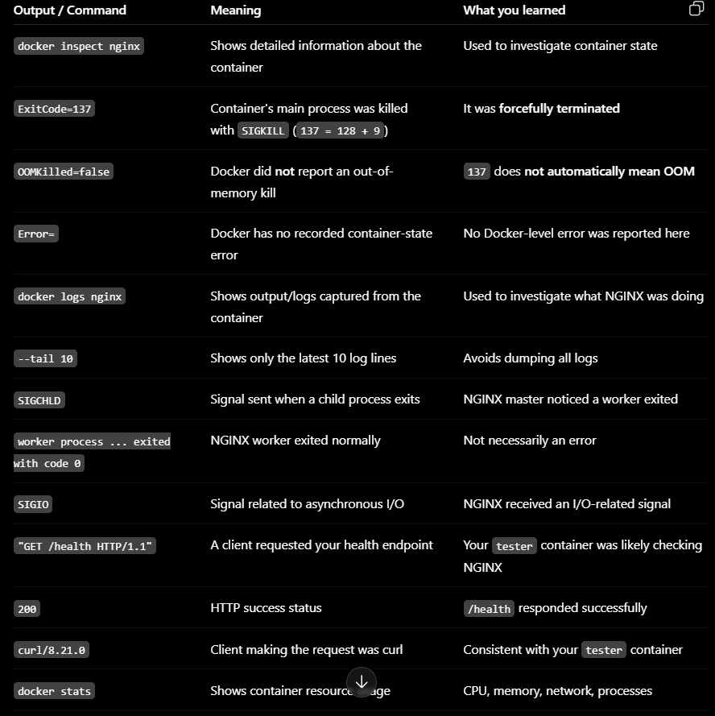
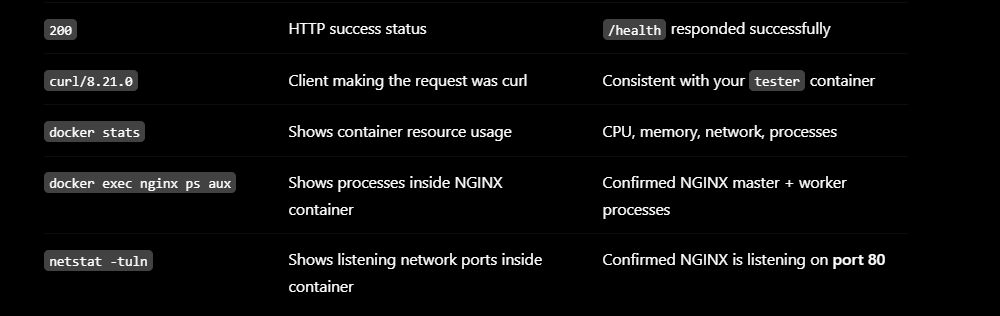

# DAY 2 — Docker Deep Dive + Linux

Date:

## Daily build goals
- [x] Use a bind mount for NGINX configuration.
- [x] Change config without rebuilding.
- [x] Understand container-to-container communication.
- [x] Practice Linux process/service commands.
- [x] Investigate NGINX logs/status.
- [x] Document what evidence each command gives you.

## Topics to refer to
- Bind mounts vs volumes
- Docker bridge networking
- localhost inside containers
- systemctl
- journalctl
- ps / top / htop / uptime
- kill / pkill

## Interview questions

**Container runs but app is unreachable: what do you check?**
Work outward from the process: (1) is the process actually alive inside the container — `docker exec <c> ps aux`; (2) is it listening on the port you expect — `docker exec <c> netstat -tuln` or `ss -tuln`; (3) is the container's port actually published to the host — `docker compose ps` / `docker inspect` for the `Ports` mapping; (4) can you reach it from inside the container's own network first (`docker exec tester curl http://nginx/health`) before blaming the host-level mapping; (5) only then check host-side firewalls/other processes squatting on the port (we hit this ourselves — port 8080 was already taken on the host).

**NGINX is down: what do you check first?**
First, is the container/process even running — `docker compose ps` or `systemctl status nginx` on a bare host. That single check splits the problem in two completely different directions: no process means look at why it exited (`docker logs`, exit code, `dmesg`/OOM); a running process that's still unreachable means check the port and the config, not the process.

**What does systemctl tell you?**
On a systemd-managed host, `systemctl status <service>` tells you whether the unit is active/failed/inactive, its main PID, how long it's been running, the enabled/disabled state (will it start on boot), and the last few log lines. It's the fastest single command to separate "service crashed" from "service was never started" from "service is fine."

**Where are service logs?**
For systemd units: `journalctl -u nginx` (or `-u <service>`) — centralized, timestamped, and survives across restarts. For our Dockerized NGINX: `docker logs <container>`, which captures whatever the process wrote to stdout/stderr (NGINX's access and error logs are redirected there in the official image). If a service writes its own log files instead of going through journald/stdout, you'd also check paths like `/var/log/nginx/`.

**Process kill vs service stop?**
`kill`/`docker kill` sends a signal directly to a PID — it's a blunt tool, doesn't go through any managed shutdown sequence, and (with `-9`/SIGKILL, which `docker kill` uses by default) gives the process no chance to clean up, close connections gracefully, or flush state. `systemctl stop` (or `docker stop`, which sends SIGTERM then waits before SIGKILL) asks the service to shut down through its supervisor, which can run graceful-shutdown logic and updates the supervisor's own state tracking (so it won't be flagged as an unexpected crash). We demonstrated this directly: `docker kill nginx` produced exit code 137 (128+9, SIGKILL) with no graceful worker shutdown messages, versus a normal `docker compose down` which lets NGINX's workers exit cleanly.

## Extra related topics — only if core work is stable
- Docker healthchecks
- Linux signals
- systemd units
- Restart policies

## Commands I actually learned / used

| # | Command | Why / what it does |
|---|---|---|
| 1 | `git checkout -b feature/day2-bind-mounts-linux` | New feature branch for Day 2 so bind-mount and diagnostic changes stay isolated from Day 1's baseline commit. |
| 2 | `docker compose up -d` (after editing `docker-compose.yml`) | Re-applies the Compose file — recreates `nginx` with the new bind mount and starts the new `tester` service, without touching anything else unnecessarily. |
| 3 | `docker exec tester curl -s -i http://nginx/health` | Proves container-to-container communication: `tester` reaches `nginx` by **service name**, not `localhost` or a published port — this only works because Compose puts both containers on the same user-defined bridge network with built-in DNS. |
| 4 | `docker exec nginx nginx -s reload` | Sends NGINX a graceful reload signal so it re-reads its config file. Used here to prove the bind-mounted `nginx.conf` takes effect **without rebuilding the image or recreating the container**. |
| 5 | `curl.exe -s http://localhost:8083/health` (after edit) | Confirms the live config change reached the running server — response text changed the instant we reloaded, proving the host file is the one actually in effect. |
| 6 | `docker exec nginx ps aux` | Lists processes running inside the container. Shows the NGINX master process (PID 1) and its worker processes — proves the process is alive and how many workers are running. |
| 7 | `docker exec nginx netstat -tuln` | Shows listening sockets inside the container. Confirms NGINX is bound to port 80 *inside* the container, which is a different question from whether the host can reach it. |
| 8 | `docker stats --no-stream nginx tester` | One-shot snapshot of CPU/memory/network/block IO per container. This is the container equivalent of `top`/`htop` for a whole host — useful for spotting a container quietly consuming more resources than expected. |
| 9 | `docker kill nginx` | Sends SIGKILL directly to the container's main process — an abrupt, unmanaged failure (Failure Lab). Chosen deliberately over `docker stop` to simulate a hard crash rather than a graceful shutdown. |
| 10 | `docker compose ps -a` | Same as `ps` but includes stopped/exited containers. Needed after the kill to see the `Exited (137)` status instead of the container disappearing from the default view. |
| 11 | `docker inspect nginx --format "ExitCode={{.State.ExitCode}} OOMKilled={{.State.OOMKilled}}..."` | Pulls structured failure evidence directly from Docker's container state — exit code 137 (128+9=SIGKILL) and `OOMKilled=false` confirmed this was an external kill signal, not a memory-related crash, before assuming a cause. |
| 12 | `docker logs nginx --tail 10` (post-mortem) | Checked for any error output before the kill — clean shutdown-less log (no graceful worker-exit messages) matched the SIGKILL hypothesis. |
| 13 | `docker start nginx` | Manually restarts the stopped container as the fix step — deliberately manual here (not `docker compose up -d`) to mirror "recovery" as a distinct, observable action before we automate it with Ansible later. |
| 14 | `curl.exe -s -i http://localhost:8083/health` (post-recovery) | Final verification step — confirms recovery is real (HTTP 200 + body), not just that the container's status field says "Up." This is the same instinct the guide calls "restart ≠ recovery." |

## What I achieved today

- Added a bind mount (`./app/nginx.conf:/etc/nginx/conf.d/default.conf:ro`) so NGINX config can be edited on the host and reloaded live, without rebuilding the image.
- Added a `tester` service (curl image, `sleep infinity` entrypoint) purely to prove container-to-container networking via Compose's service-name DNS (`http://nginx/health` resolved and responded from inside another container).
- Practiced the Linux/Docker diagnostic ladder: `ps aux`, `netstat -tuln`, `docker stats` — and wrote down what each one actually proves rather than just running them.
- Ran a full Failure Lab cycle on NGINX: wrote a hypothesis first, killed the container with `docker kill`, observed the predicted symptoms (curl failed with exit 7, container showed `Exited (137)`), collected evidence (`docker inspect` exit code + OOMKilled flag, `docker logs`) **before** fixing, then manually recovered with `docker start` and verified with a real `/health` curl — not just a status check.

## What I learned / what broke / what I want to remember

- `docker kill` = SIGKILL, no graceful shutdown. `docker logs` after the kill had no "worker process exited" messages — that absence is itself evidence you can point to when explaining what happened.
- Exit code 137 always decodes as 128 + signal number (9 = SIGKILL). Worth remembering as a fast mental shortcut during troubleshooting instead of looking it up each time.
- Bind mounts flip the ownership question: the host file is now the source of truth for that one file, while everything else still comes from the image. Good to be explicit (`:ro`) so a container can't accidentally write back to a config file it shouldn't own.
- Compose's automatic per-project network + internal DNS is why `http://nginx/...` worked from `tester` — this is the same mechanism Prometheus will use later to scrape NGINX by service name instead of an IP.
- Confirmed the core instinct the guide keeps repeating: a container's "Up" status is not proof of health. Only the `/health` response after recovery counted as real verification.

nginx.conf is NGINX's configuration file.
It tells the NGINX server how it should behave.

But NGINX needs to know things like:

Which port to listen on
Where website files are located
What to do when /health is requested
How to handle different URLs
Whether to act as a reverse proxy

nginx.conf is NGINX's configuration file.
It tells the NGINX server how it should behave.

But NGINX needs to know things like:

Which port to listen on
Where website files are located
What to do when /health is requested
How to handle different URLs
Whether to act as a reverse proxy

