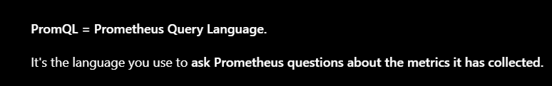
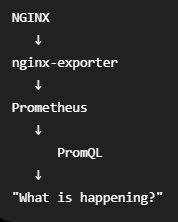
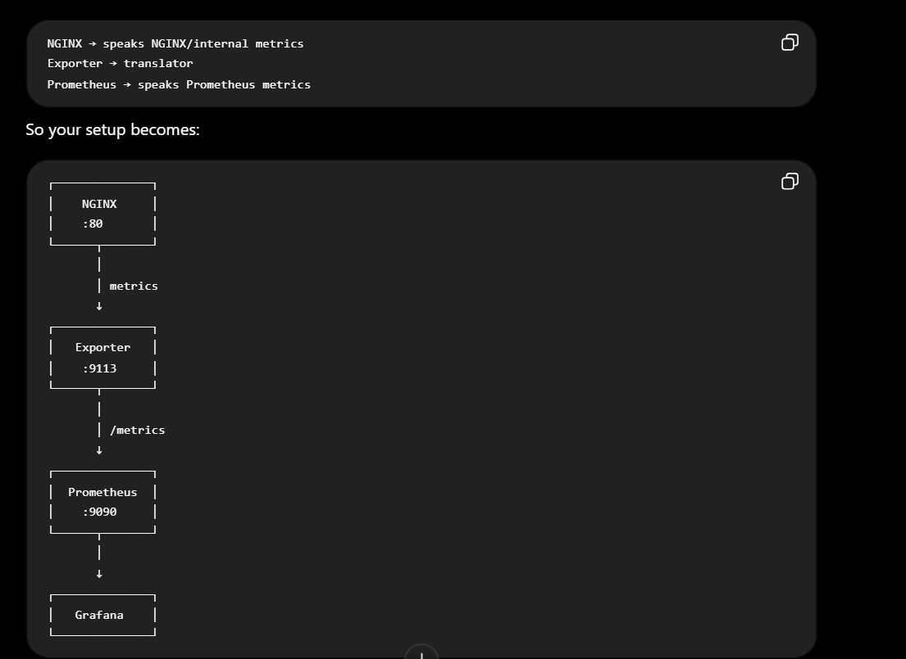
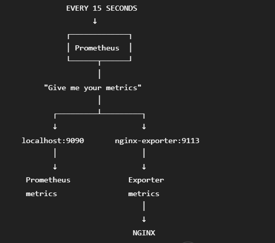
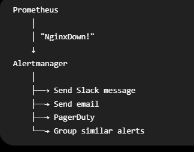
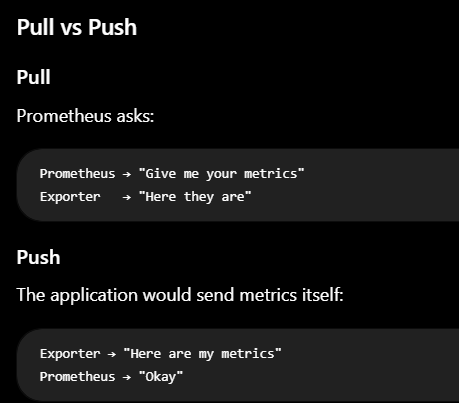
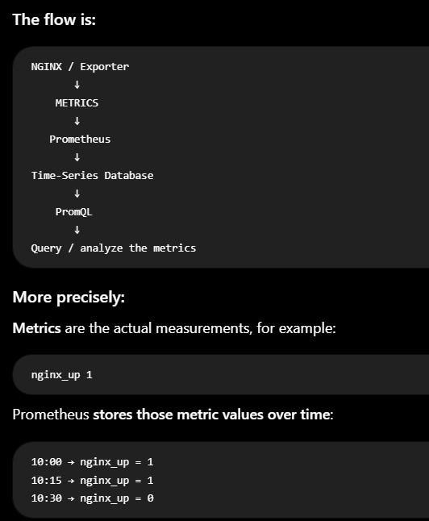

# DAY 3 — Prometheus Monitoring

Date:

## Daily build goals
- [ ] Run Prometheus with Compose.
- [ ] Configure targets.
- [ ] Confirm targets are reachable.
- [ ] Find useful service-health metrics.
- [ ] Write a first alert rule.
- [ ] Test it with a controlled failure.

## Topics to refer to
- Prometheus architecture
- Scraping
- Targets
- Metrics
- PromQL basics
- Alert rules
- Evaluation intervals

**What does Prometheus do?**
Prometheus is a metrics-based monitoring system. On a fixed interval it pulls ("scrapes") numeric metrics from HTTP endpoints exposed by the things it monitors, stores them as time series (metric name + labels + timestamp + value), and lets you query them with PromQL. It also continuously evaluates alert rules against those metrics and marks alerts as firing when a condition stays true long enough. It doesn't fix anything itself — it's the detection layer that everything downstream (Alertmanager, our webhook, Ansible) reacts to.

**Why is Prometheus commonly scrape-based?**
Prometheus usually pulls metrics from services instead of waiting for them to send metrics. It does this on a fixed schedule, such as every 15 seconds. This makes monitoring easier because Prometheus knows exactly when it tried to contact a service and whether the service responded. If the target doesn't respond, Prometheus can automatically set its up metric to 0. Pulling also makes debugging easier because you can manually visit the same metrics endpoint with curl and see what Prometheus is collecting.

**What is a target?**
A target is an endpoint that Prometheus connects to and collects metrics from. A target usually consists of a host, port, and metrics path, such as nginx-exporter:9113/metrics. Targets are organized into jobs in prometheus.yml. In our project, the nginx job points to the nginx-exporter, while the prometheus job points to Prometheus itself. Prometheus automatically adds labels such as job and instance to the metrics, which lets us query a specific target using something like up{job="nginx"}. One important thing to remember: Prometheus is scraping the nginx-exporter, not NGINX directly. The exporter is the one that talks to NGINX.

**What makes a useful alert?**
It should fire on something a human or automation would actually act on — a symptom the user feels, not an internal curiosity. It needs to be unambiguous about what's broken, be tied to a metric that genuinely represents that failure, include a `for` duration so it reflects a sustained condition rather than a blip, and carry enough annotation context (summary/description) that whoever receives it knows what to do. Our `NginxDown` qualifies: NGINX being unreachable is real user-facing breakage, and it directly triggers recovery.

**Why avoid alerts for tiny fluctuations?**
Because they create noise, and noise destroys trust in the alerting system — once people start ignoring alerts, the alerting system is worse than useless. Metrics are sampled, so a single scrape can miss for harmless reasons (brief network hiccup, a process restarting, a GC pause). The `for:` clause exists for exactly this: the condition has to hold across multiple evaluation cycles before the alert escalates from `pending` to `firing`. In a self-healing system there's an extra reason — a hair-trigger alert would fire recovery automation unnecessarily, and repeated needless restarts can cause the very outage you were trying to prevent.

**How would you detect NGINX unavailable?**
This is where today's real lesson landed. There are two distinct signals and they answer different questions:
- `up{job="nginx"} == 0` → "Prometheus couldn't scrape the target." But the target is the **exporter**, so this only tells you the exporter is unreachable. NGINX can be completely dead while this stays `1`.
- `nginx_up == 0` → the exporter's own gauge for "did my last scrape of NGINX's `/stub_status` succeed." This is the signal that actually tracks NGINX's health.

So: alert on `nginx_up == 0` for NGINX being down, and keep `up{job="nginx"} == 0` as a separate, lower-severity alert meaning "NGINX health is now unobservable." I verified both empirically — details in the notes below.

## Extra related topics — only if core work is stable
- Node Exporter
- cAdvisor
- Recording rules
- Alert duration
- Metric cardinality

## Commands I actually learned / used

| # | Command | Why / what it does |
|---|---|---|
| 1 | `git checkout -b feature/day3-prometheus` | New feature branch for Day 3 so monitoring changes stay separate from Day 1/2 commits. |
| 2 | `docker compose up -d` | Applies the updated Compose file — creates `nginx-exporter` and `prometheus`, leaves already-running containers alone. |
| 3 | `curl.exe -s http://localhost:9113/metrics \| Select-String "nginx_up"` | Reads the exporter's raw Prometheus-format output directly, bypassing Prometheus. Proves the exporter is translating NGINX's stub_status before blaming Prometheus for missing data. |
| 4 | `curl.exe -s "http://localhost:9090/api/v1/targets" \| ConvertFrom-Json ...` | Queries Prometheus's API for target health — programmatic equivalent of the `/targets` page. Confirmed both jobs `up` with correct `job`/`instance` labels. |
| 5 | `curl.exe -s "http://localhost:9090/api/v1/query?query=up%7Bjob%3D%22nginx%22%7D"` | Runs a real PromQL query through the HTTP API (URL-encoded `up{job="nginx"}`). Verifies a metric's value without opening the web UI. |
| 6 | `docker logs prometheus --tail 40` | How I found the config bug — Prometheus logged a precise YAML error (`field alertmanager not found`) with the line number. A container that exits instantly usually explains itself in its logs. |
| 7 | `docker compose ps -a` | The `-a` matters: includes exited containers. Without it the crashed `prometheus` container didn't appear at all and looked like it was never created. |
| 8 | `docker kill nginx` | Deliberate reversible failure for the detection experiment (SIGKILL → `Exited (137)`). Same Failure Lab pattern as Day 2, now with monitoring watching. |
| 9 | `curl.exe -s "http://localhost:9090/api/v1/rules" \| ConvertFrom-Json ...` | Shows each rule's `state` (`inactive`/`pending`/`firing`) plus its query. The single most useful command for "why isn't my alert firing" — it proved the expression was never true. |
| 10 | `docker kill --signal=HUP prometheus` | SIGHUP makes Prometheus hot-reload config and rule files — applies edits without restarting the container or losing collected metrics. |
| 11 | `curl.exe -s "http://localhost:9090/api/v1/alerts" \| ConvertFrom-Json` | Lists only currently-firing alert instances. Used to confirm the alert fired, and after recovery that it actually resolved. |
| 12 | `docker inspect nginx --format "ExitCode={{.State.ExitCode}} OOMKilled={{.State.OOMKilled}}"` | Structured failure evidence: exit `137` = 128+9 (SIGKILL), `OOMKilled=false` → external kill, not a memory crash. |
| 13 | `docker start nginx` | Manual recovery step. Deliberately manual today — Day 4 hands this to Ansible. |
| 14 | `curl.exe -s -i http://localhost:8083/health` | Real end-user verification after recovery: HTTP 200 + `ok`. A container showing "Up" is not proof the service works. |
| 15 | `Start-Process "...\Docker Desktop.exe"` + polling `docker info` | Docker Desktop dropped mid-session again. Polling `docker info` until exit 0 is the reliable way to wait out engine startup. |

## What I learned / what broke / what I want to remember

**1. The big one: `up` ≠ "the service is healthy."**
My first `NginxDown` rule was `up{job="nginx"} == 0`, copied from the reference config. I killed NGINX and waited — the alert never fired, not even `pending`. NGINX stayed down 35+ minutes with zero alerts.

Root cause: `up` means "could Prometheus scrape *the target*," and the target is `nginx-exporter:9113`, not NGINX. The exporter was still healthy and answering scrapes, so `up{job="nginx"}` never budged from `1`. Meanwhile `nginx_up` — the exporter's own gauge for "did *my* scrape of NGINX succeed" — had correctly gone to `0` immediately.

`GET /api/v1/rules` exposed it: `"state": "inactive"` next to the literal query string made it obvious the expression was never true, rather than a routing/config problem.

Fix: `NginxDown` now uses `nginx_up == 0` (critical), plus a second rule `NginxExporterDown` on `up{job="nginx"} == 0` (warning) — because the exporter dying is a different failure: NGINX might be fine but its health is now **unobservable**. Two failure modes, two alerts. The reference table listing `up` and `nginx_up` as separate rows makes much more sense now.

**2. A "successful" command proves nothing about the system.**
`docker compose up -d` succeeded, containers said "Up", config loaded — and alerting was still silently broken. It only surfaced because I deliberately broke NGINX and checked whether the alert actually fired.

---

Whats is PromQL

prometheus.yml is the configuration file for Prometheus.
It tells Prometheus where to collect metrics from, how often to collect them, and what endpoints to scrape.

Prometheus is a monitoring and metrics collection system.
It collects numerical information such as:
CPU usage
Memory usage
Request count
Request latency
Number of errors
Container metrics

What does prometheus.yml do?
It tells Prometheus:

"What should I monitor and where should I get the metrics from?

global means default settinsg for prometheus
. What is port 9113?
Your NGINX itself listens on:
80
NGINX :80
The exporter listens on:
9113
Exporter :9113
The exporter takes information from NGINX and exposes it in Prometheus format.

scraping= prometheus goes and asks for metrics
, might do it every 15 seconds
this is called a pull model > 

1. scrape_interval = How often Prometheus checks
2. for: 2m = How long a problem must continue

WHAT ARE METRICS? The key definition: a metric is a measurable numeric value that tells you something about the state or behavior of your system.

