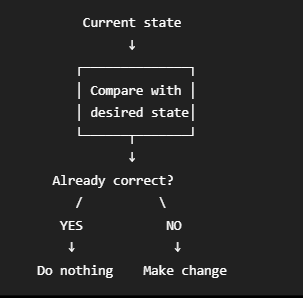
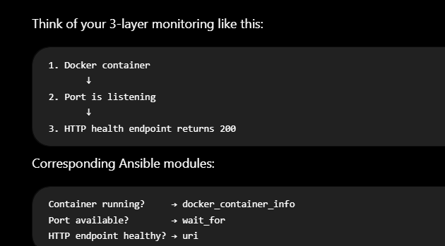

# DAY 4 — Alertmanager + Ansible Recovery

Date: 2026-09-19

## Daily build goals
- [x] Run Alertmanager.
- [x] Connect Prometheus alerts to Alertmanager.
- [x] Configure an authenticated webhook receiver.
- [x] Create the recovery trigger with restart-loop protection.
- [x] Write an Ansible playbook to restart NGINX.
- [x] Test recovery manually first.
- [x] Verify service after recovery at process, port, and HTTP levels.
- [x] Run the complete automatic failure → recovery → resolution demo.

## Topics to refer to
- Alertmanager routing, grouping, receivers, repeats, and resolved notifications
- Webhooks and HTTP POST payloads
- Bearer-token authentication and secret files
- Ansible inventory, plays, tasks, modules, registered results, retries, and assertions
- Recovery validation: process → port → `/health`
- Restart-loop guards: cooldown, attempt window, maximum attempts

## Interview questions and answers

### Why use Alertmanager?
Prometheus decides **what condition is wrong** by evaluating metrics and alert rules. Alertmanager decides **what to do with a firing alert**: group duplicates, route it to the right receiver, control repeat timing, silence or inhibit notifications, and send resolved notifications.

Keeping those jobs separate prevents alert rules from containing delivery logic. In this project, Prometheus sends `NginxDown` to Alertmanager; Alertmanager routes only that alert to the recovery webhook while `NginxExporterDown` does not blindly restart NGINX.

### What is a webhook?
A webhook is an HTTP endpoint that waits for another system to send it an event, usually as a JSON POST request. It is event-driven: Alertmanager calls `/recover` when an alert fires instead of the recovery application repeatedly polling Alertmanager.

Our webhook logs the alert name and status, authenticates the Bearer token, ignores `resolved` events, checks recovery limits, runs Ansible for firing alerts, and returns a success or failure response.

### How does Ansible know which machine to configure?
Ansible reads an **inventory**, which defines target hosts and connection methods. A playbook's `hosts:` value selects a group or host from that inventory.

In this local Docker lab, the inventory uses `localhost ansible_connection=local`, because Ansible runs inside the webhook container and controls Docker through the mounted socket. On EC2, the inventory will identify the remote host and Ansible will connect using SSH or SSM with appropriate credentials.

### Why is idempotence useful?
An idempotent operation can run repeatedly and still leave the system in the same desired state instead of creating duplicate or harmful changes. This makes automation safer after retries, duplicate alerts, partial failures, and human re-runs.



The validation tasks are read-only and repeatable. The restart command intentionally changes the service each time, so it is protected by Alertmanager repeat timing plus webhook cooldown/circuit-breaker limits; a more mature setup could use state checks or handlers to avoid unnecessary restarts.

### How should automated recovery be limited?
Recovery must be narrow, authenticated, observable, rate-limited, and allowed only for known failure modes with a safe action. It must stop and escalate to a human after repeated failures rather than creating an infinite restart loop.

This project uses several layers: only `NginxDown` is routed to recovery; a Bearer token is required; Alertmanager has a five-minute repeat interval; the webhook has a 60-second cooldown and allows at most three attempts per ten-minute window; each attempt has a timeout; and failed validation returns an error instead of claiming success.

### How do you verify recovery?
A successful restart command is not proof of recovery. Verification should increase in confidence: **Level 1** confirms the container process is running, **Level 2** confirms port 80 accepts connections, and **Level 3** confirms `/health` returns HTTP 200 with the expected `ok` response.

We also verify the monitoring feedback loop: `nginx_up` returns to `1`, the Prometheus rule becomes `inactive`, Alertmanager has no active alert, and the webhook receives a `resolved` event without starting another recovery.

ed

## Commands I actually learned / used

| # | Command | Why / what it does |
|---|---|---|
| 1 | `docker compose up -d --build` | Builds the custom recovery-webhook image and creates Alertmanager plus the webhook. `-d` leaves the six-service stack running in the background. |
| 2 | `docker compose ps -a` | Shows running and exited services. This exposed that Docker Desktop had stopped most containers with exit 255 while NGINX restarted because it had a restart policy. |
| 3 | `docker exec prometheus promtool check config /etc/prometheus/prometheus.yml` | Validates Prometheus YAML and referenced rule files before relying on runtime behavior. It confirmed one rule file and two valid rules. |
| 4 | `docker exec alertmanager amtool check-config /etc/alertmanager/alertmanager.yml` | Validates Alertmanager routes, receivers, matchers, and webhook configuration. It confirmed two receivers and a valid routing tree. |
| 5 | `docker exec recovery-webhook ansible-playbook --syntax-check -i /ansible/inventory.ini /ansible/restart_nginx.yml` | Parses the playbook without changing NGINX. This catches YAML/task/module errors before a real recovery attempt. |
| 6 | `curl.exe -s http://localhost:9090/api/v1/alertmanagers` | Queries Prometheus to prove it discovered `http://alertmanager:9093/api/v2/alerts`. This verifies the Prometheus → Alertmanager connection, not merely that both containers are up. |
| 7 | `curl.exe -s http://localhost:9093/-/ready` | Calls Alertmanager's readiness endpoint. `OK` means its config loaded and it is ready to receive alerts. |
| 8 | `docker exec tester curl -s http://recovery-webhook:5000/healthz` | Tests the internal webhook from another Compose service using service-name DNS. The webhook is intentionally not published to the Windows host. |
| 9 | `docker exec tester curl ... -X POST http://recovery-webhook:5000/recover` (without token) | Proves access control works. The webhook returned HTTP 401 and did not execute Ansible. |
| 10 | `docker exec recovery-webhook ansible-playbook -i /ansible/inventory.ini /ansible/restart_nginx.yml` | Manual recovery test required before automation. It passed all seven tasks: restart, pause, process check, port check, HTTP check, and final assertion. |
| 11 | `git check-ignore -v secrets/webhook_token` | Shows the exact `.gitignore` rule protecting the real token. `git ls-files` also confirmed the secret is not tracked. |
| 12 | `docker kill nginx` | Introduces the controlled hard failure. Prometheus then observed `nginx_up` changing from 1 to 0 and moved `NginxDown` from inactive to pending to firing. |
| 13 | `curl.exe -s http://localhost:9090/api/v1/rules \| ConvertFrom-Json ...` | Polls the Prometheus rule state. It supplied timestamped evidence of the alert lifecycle during the automated demo. |
| 14 | `docker logs recovery-webhook --since 5m` | Proves Alertmanager called the webhook and shows the outcome: firing alert received, Ansible run started, validation passed, then resolved alert received and ignored. |
| 15 | `curl.exe -s http://localhost:9093/api/v2/alerts` | Checks Alertmanager's active alerts after recovery. An empty result, together with Prometheus state and `/health`, proves the alert resolved completely. |

## What I achieved today

- Added Alertmanager and connected Prometheus to it using the correct `alerting.alertmanagers` configuration.
- Added an Alertmanager route that sends only `NginxDown` to recovery, with grouping and repeat timing. `NginxExporterDown` does not trigger a blind restart.
- Built an authenticated Flask recovery webhook that logs alert payloads, ignores resolved events, enforces cooldown/attempt limits, runs Ansible, and reports verified success or failure.
- Generated a random local token, mounted it as a file into Alertmanager and the webhook, and verified it is ignored by Git. An unauthenticated POST returned 401.
- Created an Ansible inventory and recovery playbook with three validation levels: running container, open port, and successful `/health` response with expected content.
- Validated configurations with `promtool`, `amtool`, and `ansible-playbook --syntax-check`.
- Ran the complete automated demo. Baseline was healthy with zero alerts and zero webhook attempts. After `docker kill nginx`, `nginx_up` changed to 0, `NginxDown` became pending then firing, Alertmanager POSTed to the webhook, Ansible restarted and validated NGINX, `nginx_up` returned to 1, and the alert resolved.

### Automated demo evidence

```text
BASELINE health=ok firingAlerts=0 webhookAttempts=0
BREAK: docker kill nginx
t=20s  nginx_up=0 rule=inactive nginxRunning=false webhookAttempts=0
t=40s  nginx_up=0 rule=pending  nginxRunning=false webhookAttempts=0
t=140s nginx_up=0 rule=pending  nginxRunning=false webhookAttempts=0
t=150s nginx_up=1 rule=firing   nginxRunning=true  webhookAttempts=1
AUTOMATIC RECOVERY OBSERVED
FINAL health=ok HTTP=200 NginxDown=inactive prometheusAlerts=0 alertmanagerAlerts=0
```

Webhook evidence:

```text
alert received: status=firing alerts=['NginxDown']
running recovery: ansible-playbook -i /ansible/inventory.ini /ansible/restart_nginx.yml
recovery succeeded and passed validation
alert received: status=resolved alerts=['NginxDown']
alert resolved — no recovery needed
```

## What I learned / what broke / what I want to remember

1. **Alertmanager manages notifications; it does not evaluate PromQL.** Prometheus owns rule evaluation. Alertmanager receives already-firing alerts and handles grouping, routing, repeats, silences, inhibition, and resolved events.
2. **Restart is an action; recovery is a verified outcome.** The Ansible command can return zero while the app is still unusable. Process → port → HTTP response → recovered metric → resolved alert is the real proof chain.
3. **The recovery endpoint is effectively an administrative interface.** Leaving it unauthenticated would let any reachable client restart NGINX. The real token is generated randomly, mounted from a gitignored file, and compared using a constant-time comparison.
4. **The Docker socket is powerful and risky.** Mounting `/var/run/docker.sock` lets the webhook control sibling containers and is effectively root-level Docker access. It is acceptable for this isolated lab but should be replaced by tightly scoped SSH/SSM/IAM access on EC2.
5. **Automatic recovery needs brakes.** Alertmanager repeat timing prevents a POST every scrape, while the webhook cooldown and attempt window stop rapid or repeated restarts. If attempts keep failing, stop and require investigation.
6. **Resolved alerts must not trigger recovery.** `send_resolved: true` is useful evidence, but the webhook must check `status == resolved` and log/ignore it. The real demo confirmed exactly that behavior.
7. **The earlier cooldown test was not actually immediate, so I re-tested it correctly.** Logs showed the first two manual requests were about 147 seconds apart, longer than the 60-second cooldown. In the final validation, one authorized recovery returned HTTP 200 and the immediate second request returned HTTP 429 with `cooldown active, 52s remaining`; NGINX remained healthy. The guard is now directly verified.
8. **Docker Desktop restarts are not application incidents.** Several containers exited with 255 when the engine stopped; NGINX alone restarted due `restart: unless-stopped`. Always distinguish an infrastructure/runtime interruption from a monitored NGINX failure.

BASICS:
Alert = information about a problem.
Route = decides where an alert should go.
Receiver = the destination configuration for an alert.
Webhook = the URL/API endpoint where Alertmanager sends the alert information.


Alertmanager's job: NOTIFY + MANAGE

Alertmanager receives:

🚨 NginxDown
severity = critical

Then it can decide what to do with it:

Send a Slack notification
Send an email
Send a PagerDuty alert
Group several alerts together
Avoid sending the exact same alert repeatedly
Temporarily silence an alert during maintenance
Route different alerts to different teams

A webhook receiver is simply a URL that waits to receive messages from another system.

Concepts in AlertManager:

### GROUPING
Grouping categorizes alerts of similar nature into a single notification. This is especially useful during larger outages when many systems fail at once and hundreds to thousands of alerts may be firing simultaneously.

when multiple services fail , prometheus sends alert fo reach service , and so multiple alerts are sent to AlertManager.

 one can configure Alertmanager to group alerts by their cluster and alertname so it sends a single compact notification

 ###Inhibition: Inhibition is a concept of suppressing notifications for certain alerts if certain other alerts are already firing.
why is this useful : One underlying problem can cause many alerts. , THEREFORE THE ROOT CAUSE -ALERT MUST BE SENT and the rest can be supressed.

###SILENCES : A silence is basically a temporary "mute" for an alert.


For your Alertmanager, you would reason:

“I need Alertmanager, so I'll create an alertmanager service. I already have an Alertmanager image, so I'll use image. It needs my configuration file, so I'll mount alertmanager.yml. It needs the webhook token, so I'll mount that secret. I want to open its UI from my browser, so I'll publish 9093:9093.”

For your recovery webhook, you'd reason:

“This is my own application, so I'll build it from ./recovery/webhook. It needs the webhook token, so I'll mount the secret and tell the application its location through an environment variable. It needs the Ansible playbooks, so I'll mount that directory. It needs Docker access to restart the NGINX container, so I'll mount the Docker socket. Alertmanager needs to call it, but my laptop doesn't, so I won't use ports; I'll make port 5000 available internally.”

That's how you should write Compose from requirements rather than copying YAML.

Ansible uses simple, human-readable scripts called playbooks to automate your tasks. You declare the desired state of a local or remote system in your playbook. Ansible ensures that the system remains in that state.




In Ansible, wait_for is used when you want Ansible to wait until something is ready before moving to the next step. For example, after starting an NGINX container, the container might be running but NGINX may still be starting. So wait_for can keep checking whether port 80 is available/listening and only continue once it is ready, or until a timeout is reached. The uri module is different: it actually sends an HTTP request to a URL and checks the response. So in your three-layer health check, wait_for is basically checking "Is the port ready?", while uri checks "Does the application respond correctly, such as with HTTP 200?".