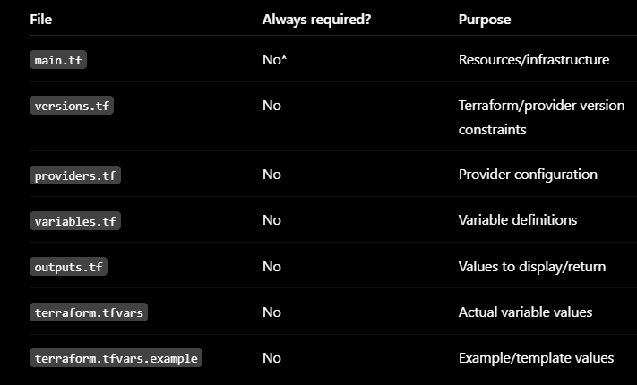

# DAY 5 — Terraform + AWS EC2

Date: 2026-09-20

## Daily build goals
- [x] Create AWS infrastructure with Terraform and validate it locally.
- [x] Provision EC2 with the required security and network configuration.
- [x] Use an IAM role instead of hard-coded credentials.
- [x] Configure the EC2 host and stack with Ansible.
- [x] Run and validate the monitoring/recovery system on EC2.
- [x] Diagnose and fix a real Linux permission failure in the recovery path.
- [ ] Test reproducibility by rebooting or replacing EC2.
- [ ] Destroy the AWS lab after evidence is saved to stop charges.

## Topics to refer to
- Terraform provider/resource
- Variables/outputs
- State
- init/plan/apply/destroy
- EC2
- Security Groups
- IAM roles

## Interview questions and answers

### What is Terraform state?
State is Terraform's record of which real-world resources it manages and what attributes they have. When you run `apply`, Terraform reads the state file, compares the desired configuration with the recorded reality, and generates only the differences (create/update/destroy).

Without state, Terraform could not know that an existing EC2 instance already belongs to this configuration versus one that should be deleted. In this lab the state is local and gitignored; a team setup would move it to a remote backend with locking so everyone shares one source of truth.

### Why is plan useful?
`terraform plan` is a dry-run that shows what Terraform will change before anything is touched. It reports which resources will be added, changed, or destroyed, and surfaces errors such as missing variables or invalid security-group rules before real (billable) AWS resources are created.

It is the inspection step. The README workflow requires reviewing the plan for wildcard ingress, NAT gateways, databases, or load balancers before ever running `apply`.

### Infrastructure creation vs configuration?
These are two different jobs owned by two tools:

- **Terraform creates infrastructure:** VPC, subnet, internet gateway, security group, IAM role, and the EC2 instance itself.
- **Ansible configures the operating system:** installs Docker/Compose/Git, writes the secret, installs the systemd unit, starts the Compose stack, and verifies NGINX/Prometheus/Alertmanager.

Terraform does not know how to install Docker; Ansible does not know how to create a subnet. Keeping them separate makes each step reproducible and independently testable.

### Why use an IAM role on EC2?
An IAM role attached through an instance profile lets AWS deliver short-lived, automatically rotating credentials to the instance instead of storing a long-lived access key on disk. The instance can assume the role without any key in code, config, or environment.

Here the role has only `AmazonSSMManagedInstanceCore`, so the operator can reach the host through Session Manager without opening SSH or embedding credentials. If the instance is compromised, the leaked credential is temporary and narrowly scoped, and the role can be removed.

### What network access is actually required?
Minimal inbound and only what is needed outbound:

- Inbound TCP 8083 from the operator's `/32` CIDR to reach the NGINX demo.
- No inbound SSH by default; access is via AWS SSM Session Manager.
- Outbound internet for `apt`, pulling container images, reaching GitHub, and the SSM agent.

Prometheus (9090), Alertmanager (9093), and the exporter bind to loopback only and are reached through SSM port forwarding. The recovery webhook stays on the Compose network and is never published.

### What should never be committed to Git?
Secrets and any credential-bearing or environment-specific state:

- AWS access/secret keys and private SSH keys (`.pem`).
- `terraform.tfvars` (real values) and Terraform state files.
- The generated webhook token (`secrets/webhook_token`).

Only examples/templates are committed (`terraform.tfvars.example`, `webhook_token.example`). If someone clones the repo, they must receive zero working secrets.

## Extra related topics — only if core work is stable
- Remote state
- Terraform modules
- SSM
- CloudWatch
- KMS

## Commands I actually learned / used

| # | Command | Why / what it does |
|---|---|---|
| 1 | `terraform fmt -check -recursive` | Checks whether every `.tf`/`.tftest.hcl` file follows canonical formatting. Exit 0 confirmed the code is already formatted. |
| 2 | `terraform validate` | Parses and type-checks the whole configuration without contacting AWS. Returned `Success! The configuration is valid.` |
| 3 | `terraform test` | Runs the mock-plan tests in `tests/security.tftest.hcl` using a mocked AWS provider. Passed 2/2: safe defaults and rejection of `0.0.0.0/0`. |
| 4 | `terraform init` | Initializes the working directory and installs the pinned `hashicorp/aws` 6.65.0 provider from the dependency lock file. |
| 5 | `terraform plan -var "admin_cidr=203.0.113.10/32"` | Generates the change plan. It correctly passed variable validation, then stopped with `No valid credential sources found` — the expected result with no AWS CLI, proving only credentials are missing. |
| 6 | `python -m py_compile recovery/webhook/app.py` | Compiles the webhook without running it, catching Python syntax errors after the hardening edits. Exit 0. |
| 7 | `python -c "import yaml; yaml.safe_load(...configure_ec2.yml)"` | Parses the Ansible playbook as YAML to confirm it is well-formed before it ever runs on EC2. |
| 8 | `docker compose config --quiet` | Validates `docker-compose.yml` after the loopback-only port and restart-policy changes. Exit 0. |

## What I achieved today

- Wrote a complete Terraform configuration split across `versions.tf`, `providers.tf`, `variables.tf`, `main.tf`, `outputs.tf`, `terraform.tfvars.example`, and `tests/security.tftest.hcl`.
- Defined a disposable lab: dedicated VPC, public subnet, internet gateway, route table, and a security group that allows only TCP 8083 from the operator CIDR (SSH opt-in, default off; `0.0.0.0/0` rejected by validation).
- Attached an EC2 IAM role with only `AmazonSSMManagedInstanceCore`, enforced IMDSv2 tokens, and used an encrypted gp3 root volume.
- Wrote an Ansible bootstrap script (`bootstrap-ec2.sh`) and playbook (`configure_ec2.yml`) that clone the repo, install Docker/Compose/Git, write the webhook token as `root:65534` with `0640` permissions, install a systemd unit for the stack, and verify all services.
- Hardened the existing stack for EC2: Prometheus/Alertmanager/exporter bind loopback-only, all services got `restart: unless-stopped`, and the webhook now rejects non-firing or non-`NginxDown` payloads.
- Added `.gitattributes` to force LF line endings for shell/YAML/Terraform files so `bootstrap-ec2.sh` executes correctly on Linux.
- Validated locally with `terraform fmt`, `validate`, and `test`; then created and applied a real reviewed AWS plan, connected through SSM, and configured the EC2 stack with Ansible.

## What I learned / what broke / what I want to remember

1. **`terraform test` is the local dry-run.** It uses a mocked provider and overridden data sources so the whole plan path is exercised without AWS credentials or billable resources. It proved the restricted CIDR, SSH-off default, IMDSv2, encrypted root volume, and instance type before any real apply.
2. **A missing credential is a good failure.** `terraform plan` failing with `No valid credential sources found` after passing variable validation means the configuration and provider wiring are correct — the only gap is authentication, which is exactly the documented prerequisite.
3. **Terraform and Ansible own different halves.** Terraform builds the VPC/EC2/IAM; Ansible turns that bare instance into a working host. The bootstrap script bridges them by cloning the repo and running Ansible locally over SSM.
4. **SSM replaces SSH as the safe path.** No key pair, no inbound 22, no long-lived AWS key on the instance. The role grants only Session Manager, and the UIs are reached via SSM port forwarding instead of public security-group rules.
5. **Loopback-only is the correct default on EC2.** Prometheus, Alertmanager, and the exporter must not be world-reachable. Only NGINX on 8083 is exposed, and only to the operator's `/32`.

do we need all .tf files

 

 versions.tf — "What versions can I use?"

Specifies the required Terraform version.
Specifies which providers the project needs and their versions.


roviders.tf — "How do I connect to AWS?"

Configures the AWS provider.
Tells Terraform that you're going to work with AWS

variables.tf — "What values can I customize?"

Defines variables that your Terraform configuration can use.
Instead of hardcoding values everywhere, you create variables.

Example:

variable "instance_type" {
  type    = string
  default = "t2.micro"
}

Then your main.tf can use:

instance_type = var.instance_type
Think: "What inputs does my infrastructure need?"

main.tf — "What infrastructure should I create?"

This is usually where your actual AWS resources are defined.

terraform.tfvars.example — "Here is an example of the input values."

Provides sample values for the variables defined in variables.tf.

Example:

instance_type = "t2.micro"
region        = "ap-south-1"
The .example part is important: it's usually a template, not the actual configuration you use.


---

# Questions I Asked During Day 5 — Simple Answers

This section preserves the questions asked while completing Day 5 and the answers in easy words. It includes the real problems we encountered, how we understood them, and how we fixed them.

## 1. What are we doing on Day 5?

We are moving the project from the local Windows computer to an AWS EC2 virtual machine.

The responsibility is divided like this:

```text
Terraform → creates AWS infrastructure
Ansible   → configures the EC2 operating system
Compose   → runs the application and monitoring containers
```

Terraform creates the VPC, subnet, internet access, Security Group, IAM role, encrypted disk and EC2 instance. Ansible installs Docker, stores the webhook token, creates the systemd service, starts Compose and verifies the services.

## 2. What did we do on Day 5, step by step?

We:

1. Created `feature/day5-terraform-aws`.
2. Installed Terraform 1.16.2.
3. Added the pinned AWS provider 6.65.0.
4. Wrote the Terraform files.
5. Added a dedicated VPC and public subnet.
6. Restricted NGINX port 8083 to the operator's public `/32` address.
7. Kept Prometheus, Alertmanager and exporter on `127.0.0.1`.
8. Added an SSM-enabled EC2 IAM role.
9. Created an encrypted Ubuntu `t3.small` EC2 instance.
10. Wrote the EC2 bootstrap and Ansible playbook.
11. Validated Terraform and Ansible locally.
12. Fixed missing AWS IAM permissions.
13. Connected through Session Manager without SSH.
14. Ran Ansible on EC2 and started the six-container stack.
15. Verified NGINX, Prometheus, Alertmanager and the webhook.
16. Deliberately stopped NGINX and investigated why recovery initially failed.
17. Fixed the Linux token-file permissions so Alertmanager could call the webhook.

## 3. Do we need all the `.tf` files?

Terraform loads all `.tf` files in the same folder together. The filenames are mainly for humans to keep the project organized.

```text
versions.tf  → required Terraform and provider versions
providers.tf → AWS provider settings and common tags
variables.tf → values users can customize
main.tf      → AWS resources to create
outputs.tf   → useful values printed after apply
```

They could technically be one large file, but separate files are easier to read and maintain.

## 4. What does `terraform fmt` do?

```powershell
terraform fmt -recursive
```

It fixes indentation, spaces and alignment in Terraform files. It makes the code neat but does not create or change AWS resources.

```powershell
terraform fmt -check -recursive
```

This checks that files are already formatted. It is useful in CI because it reports a problem without rewriting files.

## 5. What does `terraform init` do?

```powershell
terraform init
```

It prepares the Terraform folder and downloads the AWS provider. It also creates `.terraform.lock.hcl`, which records the exact provider version and checksum.

It does not deploy anything to AWS.

```text
.terraform/          → downloaded local provider cache; do not commit
.terraform.lock.hcl  → reproducible provider lock; commit this
```

## 6. What does `terraform validate` do?

```powershell
terraform validate
```

It checks that Terraform understands the configuration: syntax, value types, resource properties and references.

```text
validate = check that the infrastructure code makes sense
apply    = actually create or change AWS resources
```

## 7. What does `terraform test` do?

```powershell
terraform test
```

It ran our mocked AWS plans without needing real credentials or creating billable resources.

The tests confirmed:

- SSH is disabled by default.
- Port 8083 uses the supplied restricted CIDR.
- `0.0.0.0/0` is rejected.
- The EC2 disk is encrypted.
- IMDSv2 is required.
- The default instance is `t3.small`.

The result was:

```text
2 passed, 0 failed
```

## 8. What does `Plan: 12 to add, 0 to change, 0 to destroy` mean?

It means Terraform proposes creating 12 resources if we apply the plan.

It does not mean the resources were already created.

```text
add     → resource will be created
change  → existing resource will be updated
destroy → existing resource will be deleted
```

Always inspect these numbers before applying.

## 9. What does `terraform plan` do?

```powershell
terraform plan -out day5.tfplan
```

It asks AWS about the current environment and creates a preview of the exact changes Terraform wants to make.

The saved plan can be inspected with:

```powershell
terraform show day5.tfplan
```

The plan is the review step before the billable `apply` operation.

## 10. What does `terraform apply` do?

```powershell
terraform apply day5.tfplan
```

It performs the reviewed plan and creates or changes real AWS resources. This can create charges.

Our apply created the VPC, networking, Security Group, IAM role/profile and EC2 instance.

## 11. Do I need to change Windows user permissions?

No. The errors were about the permissions of the AWS IAM identity—not the Windows account.

The AWS user initially could create networking but could not create or inspect the project IAM role.

## 12. Why did Terraform say `iam:CreateRole` was denied?

Terraform tried to create the SSM role for EC2, but the AWS IAM user did not have:

```text
iam:CreateRole
```

An AWS administrator had to allow the project identity to create and manage the specifically named role and instance profile.

Terraform had already created some network resources. We preserved Terraform state so it could continue correctly instead of manually deleting random resources.

## 13. Why did Terraform later say `iam:ListRolePolicies` was denied?

After creating the role, Terraform read it back to confirm its real state. AWS denied this read operation because the user lacked:

```text
iam:ListRolePolicies
```

Terraform needs both write and read permissions. It cannot safely manage a resource if it can create it but cannot inspect it afterward.

## 14. What does `Saved plan is stale` mean?

The first apply partially changed AWS and Terraform state before failing. Therefore, the old saved plan no longer described the current state.

The correct fix was to generate a fresh plan:

```powershell
terraform plan -out day5.tfplan
terraform show day5.tfplan
terraform apply day5.tfplan
```

Never keep retrying an old saved plan after state changes.

## 15. Why did the next plan say the IAM role was tainted?

The provider created the IAM role but failed while reading it. Terraform marked it as tainted because it could not prove that creation finished correctly.

A tainted resource is treated as potentially incomplete. Terraform proposed replacing it so the final result would be known and consistent.

## 16. Why did Session Manager say permission denied?

Session Manager has two permission sides:

```text
EC2 instance role → lets the machine connect to SSM
operator IAM user → lets the person start an SSM session
```

The EC2 role already had `AmazonSSMManagedInstanceCore`, but the operator user did not initially have `ssm:StartSession`.

After a short Session Manager policy was attached to the operator, this worked:

```powershell
aws ssm start-session --target INSTANCE_ID --region us-east-1
```

## 17. Why did AWS say the JSON policy was too long?

IAM inline user policies have small character limits, and the combined Terraform plus Session Manager policy was too large.

The fix was to create a separate customer-managed policy containing only the required Session Manager permissions, then attach it to the user.

It is also clearer to separate responsibilities:

```text
Terraform infrastructure permissions → one policy
Session Manager operator access      → another policy
```

## 18. Why did typing the Session Manager installer URL fail?

A URL by itself is not a PowerShell command. PowerShell tried to execute the URL as if it were a program.

A URL must be opened in a browser or downloaded with a command such as `Invoke-WebRequest`. The official installer also required Windows administrator approval.

## 19. Why did the bootstrap URL return `404`?

The script existed locally but had not yet been pushed to GitHub `main`.

GitHub returned `404` because this remote path did not exist yet:

```text
main/infrastructure/ansible/bootstrap-ec2.sh
```

After the Day 5 commit was merged and pushed to `main`, the same URL worked.

## 20. Why did `curl -fsSLo` fail in PowerShell?

The Linux command was accidentally run at a Windows PowerShell prompt.

In PowerShell, `curl` can mean `Invoke-WebRequest`, which does not understand Linux curl flags such as `-fsSLo`. Also, `/tmp` is a Linux path and `\` is not PowerShell's continuation symbol.

```text
PS C:\...> → Windows commands
$ or sh-...$ → Linux EC2 commands
```

The bootstrap `curl` command must run after entering the EC2 SSM shell.

## 21. Why were `self-healing.service`, `/opt/self-healing`, and Docker missing?

Terraform had created a new, mostly empty EC2 machine, but the bootstrap had not run yet.

Therefore:

```text
self-healing.service missing → Ansible had not installed the systemd unit
/opt/self-healing missing    → repository had not been cloned
Docker command missing       → Docker had not been installed
```

These three messages had one root cause: host configuration was still pending.

## 22. Why did `RandomNumberGenerator.Fill()` and `Convert.ToHexString()` fail?

The installed PowerShell/.NET version did not contain those newer methods.

We used compatible APIs instead:

```powershell
$rng = [System.Security.Cryptography.RandomNumberGenerator]::Create()
$rng.GetBytes($bytes)
$token = [BitConverter]::ToString($bytes).Replace("-", "").ToLowerInvariant()
```

The token remained cryptographically random; only the API used to generate and format it changed.

## 23. Why did `(Get-Clipboard).Length` return `2`?

PowerShell can return clipboard text as a collection of lines. `.Length` then counted the collection items rather than the token characters.

The safe verification joined the clipboard lines before counting:

```powershell
$clipboardToken = ((Get-Clipboard) -join "").Trim()
$clipboardToken.Length
```

The expected token length was 64 characters.

## 24. Why did Ansible fail at `Require a non-placeholder webhook token`?

The hidden prompt received an empty, too-short or placeholder value. Most likely the clipboard paste did not reach the SSM terminal, and the same empty input was confirmed twice.

The task used `no_log: true`, so Ansible intentionally hid the value and details to prevent a secret from leaking into logs.

Nothing was damaged. The playbook stopped before configuring the stack and was safe to rerun with a valid token.

## 25. Why is the webhook token important?

The recovery webhook can run Ansible and restart NGINX. That is a powerful administrative action.

The token is a shared secret between Alertmanager and the webhook:

```text
Alertmanager sends Bearer token
→ webhook compares it with its own token
→ matching token allows recovery
→ missing/wrong token returns 401
```

Without authentication, any reachable process could repeatedly request restarts and create an outage.

## 26. Why did Alertmanager need to read the token?

Alertmanager must include this header when calling the webhook:

```http
Authorization: Bearer SECRET_TOKEN
```

If it cannot read the file, it cannot prove that the request is trusted. Alertmanager correctly refuses to send an unauthenticated recovery request.

## 27. What did the token `permission denied` error mean?

On EC2, Ansible originally created the token as:

```text
owner=root group=root permissions=600
```

Only root could read it. Alertmanager intentionally runs as non-root user/group `65534`, so it could not read the file.

The corrected setting is:

```text
owner=root group=65534 permissions=640
```

Meaning:

```text
root               → read and write
Alertmanager group → read only
everyone else      → no access
```

This keeps the token private while allowing Alertmanager to use it.

## 28. Why did this work on Windows but fail on EC2?

The local setup used Windows/Docker Desktop file sharing. EC2 uses native Linux ownership and numeric permissions.

Windows did not reveal that the non-root Alertmanager user could not read a root-only Linux file. The real EC2 test exposed the portability problem.

## 29. What did we change to fix the token permission permanently?

The Ansible playbook now writes the token as:

```text
owner: root
group: 65534
mode: 0640
```

Compose now explicitly runs Alertmanager as:

```yaml
user: "65534:65534"
```

This makes the file group and container process group match.

## 30. What does `sleep 180` do?

```bash
sleep 180
```

It pauses only the current Linux terminal command for 180 seconds, which is three minutes.

The system continues working in the background. We wait because:

```text
Prometheus `for:` duration → 2 minutes
Alertmanager group wait   → about 10 seconds
Ansible recovery          → several seconds
```

## 31. Should I wait three minutes before checking NGINX again?

Yes. You may check earlier to watch the state, but normal automated recovery needs at least the two-minute alert duration.

After waiting, check:

```bash
sudo docker compose ps -a
curl -i http://127.0.0.1:8083/health
```

## 32. Why was NGINX still down after ten minutes?

The monitoring side was working:

```text
nginx_up = 0
NginxDown = firing
Prometheus knew Alertmanager
Alertmanager held an active alert
```

The failure was between Alertmanager and the webhook. Alertmanager logs showed:

```text
unable to read authorization credentials file
permission denied
```

Because Alertmanager could not read the token, the webhook was never called and Ansible never restarted NGINX.

This demonstrated why checking every link in the chain matters.

## 33. Why did `docker compose ps` not show NGINX?

By default, `docker compose ps` mainly shows running containers. NGINX had exited, so it disappeared from that view.

Use:

```bash
sudo docker compose ps -a
```

The `-a` includes stopped containers and showed:

```text
Exited (137)
```

## 34. What does exit code `137` mean?

Exit code 137 is:

```text
128 + 9 = SIGKILL
```

It matched our deliberate `docker kill nginx` command. It was not an unexpected NGINX crash or an out-of-memory event.

## 35. Why did we temporarily disable Docker restart?

Compose uses:

```yaml
restart: unless-stopped
```

Docker could otherwise restart NGINX itself and hide whether the monitoring/recovery chain worked.

For the experiment, we ran:

```bash
sudo docker update --restart=no nginx
```

That forced recovery to happen through:

```text
Prometheus → Alertmanager → webhook → Ansible
```

After the experiment, we restored:

```bash
sudo docker update --restart=unless-stopped nginx
```

## 36. What does the recovery log command do?

```bash
sudo docker logs recovery-webhook --since 5m 2>&1 |
  grep -E 'alert received|running recovery|recovery succeeded|alert resolved'
```

It means:

1. Read logs from the `recovery-webhook` container.
2. Keep only the last five minutes.
3. Combine normal and error output using `2>&1`.
4. Pipe the result into `grep`.
5. Show only lines containing the important recovery phrases.

It only reads logs. It does not change the system.

## 37. Why did the filtered log command show no output?

Possible reasons were:

- The event happened more than five minutes ago.
- No line contained one of the exact search phrases.
- The webhook was never called.
- The container had been recreated and its older logs were gone.

To remove the filters, use:

```bash
sudo docker logs recovery-webhook --tail 200 2>&1
```

Or search a longer period:

```bash
sudo docker logs recovery-webhook --since 1h 2>&1 |
  grep -E 'alert received|running recovery|recovery succeeded|alert resolved'
```

In our failed test, the webhook logs were empty because Alertmanager could not read the token and therefore never called the webhook.

## 38. What did the successful EC2 Ansible result prove?

The playbook ended with:

```text
ok=18 changed=2 unreachable=0 failed=0
```

That proved:

- EC2 was reachable through SSM.
- Docker and Compose were installed.
- The repository existed at `/opt/self-healing`.
- The token was installed.
- The systemd unit was installed and enabled.
- NGINX returned HTTP 200.
- Prometheus was ready.
- Alertmanager was ready.
- The internal webhook returned `status=ok`.

## 39. Why does systemd show `active (exited)`?

The `self-healing.service` unit is a oneshot service. Its job is to run `docker compose up -d --build` and then finish.

The command exits successfully while the containers continue running in the background. Therefore `active (exited)` is normal for this design; it does not mean the containers stopped.
Completed:

- [x] Terraform configuration and local tests
- [x] AWS authentication and real plan
- [x] VPC, subnet, routing and Security Group
- [x] IAM role and instance profile
- [x] Ubuntu EC2 instance
- [x] SSM shell access without SSH
- [x] Ansible EC2 configuration
- [x] Docker Compose stack running on EC2
- [x] NGINX, Prometheus, Alertmanager and webhook health validation
- [x] Real alert-routing failure diagnosed
- [x] Alertmanager token permission corrected on EC2
- [x] Permanent permission correction made in local project files

Still to complete or record:

- [ ] Capture the final successful webhook recovery lines and resolved alert evidence
- [ ] Restore/confirm NGINX `unless-stopped` restart policy
- [ ] Commit and push the permanent token-permission fix
- [ ] Optionally replace/reboot EC2 to prove reproducibility
- [ ] Destroy the AWS lab when finished to avoid ongoing charges
